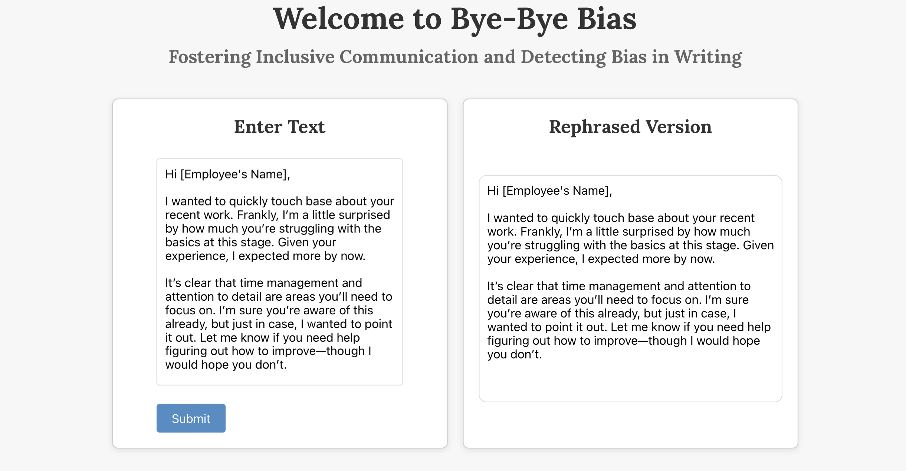

# Bye-Bye Bias

Promoting inclusive and unbiased email communication.

# About

Bye-Bye Bias helps professionals craft inclusive emails by analyzing drafts and providing suggestions to replace biased phrases. Originally planned as a browser extension, it’s now a web app due to time constraints during a mini hackathon.

# Preview

# Features
Detect Bias: Identify non-inclusive language.

Real-Time Suggestions: Improve tone and phrasing.

Foster Inclusion: Promote workplace equality through better communication.

# Tech Stack
Frontend: React, CSS, HTML

Backend: Python, Curl

# Contributors
Chandni Wadhwa, Deepika Anbalagan, Iya Sandhu
